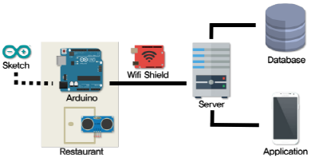

<br>
<p align="center">
  <br><br>
A real-time people counting system using ultrasonic sensors<br>
 <a href="https://github.com/PEOPLE-INSIDE/people-inside"><strong>Visit PEOPLE INSIDE &raquo;</strong></a>
<br><br><br>
</p>

[](#)
[](#)
[](#)

## Table of contents
- [About](#people-inside)
- [Purpose](#our-purpose)
- [Basic Principle](#basic-principle)
- [Quick Start](#quick-start)

## PEOPLE INSIDE
At meal time, there are too many people in a restaurant. So we have to wait in the restaurant. We want to check the number of indoor people in advance.
PEOPLE INSIDE is **a real-time people counting system using ultrasonic sensors**.
**Our system aims to measure indoor congestion metrics.**
You can check the number of people with application.

### Our Purpose
We are focusing on three main purposes.


### Quick Start

```
git clone https://github.com/PEOPLE-INSIDE/people-inside
```

## Getting Started
### Installation Environment

Before you start, make sure the environment fits perfectly.
- **ultrasonic sensorㅡ** need 4 ultrasonic sensors which parallel aligned in pairs. You must prepare inexpensive one which like `HC-SR04` we used.
- **Wifi Shieldㅡ** necessary to send data to the application.
- **Serverㅡ**
- **Applicationㅡ** required to view the processed data directly.



### Basic Principle
If the **A** sensor detects a person first, it means *IN*. And the reverse, it means *OUT*.


## How To Use
You have to choose one method that you want to use.

- **Classification Algorithmㅡ** Classification algorithm that classifies Serial datas which one is *IN* and *OUT*.
- **Random Forestㅡ** Machine Learning with data sets what we collected.

## Classifiaction Algorithm

## Random Forest
<!--
두번째 Method는 Machine Learning 기법 중 하나인 Random Forest를 이용해 분류하는 것이다.
Random Forest 알고리즘은 Decision tree의 Ensemble 기법으로 높은 정확도를 보인다.
우리는 약 2800개의 Dataset(IN:1400, OUT:1400)을 제공하며, Example code에 이미 이 Dataset으로 학습된 Decision tree Model을 제공한다.
학습된 모델은 MATLAB의 Treebagger function을 이용하여 학습되었으며 트리의 갯수는 50개이다.

우리가 제공하는 모델은 우리의 환경에 최적화되어있기 때문에 당신의 testbed에서는 좋은 성능이 나오지 않을 수 있다.
그렇기 때문에 당신이 우리의 모델을 사용하고 싶지 않다면, 직접 Data를 모아 모델을 만들어 사용 할 수도 있다.
-->

## Performance
### Test video

[Click here](https://www.youtube.com/watch?v=0aNgP3FmK0k) to watch test video.

## Developers

We have a core project team composed of:

#### [Amber Cho](https://github.com/Seo-Hyung) - Founder/Lead &nbsp;  [](https://github.com/Seo-Hyung) &nbsp; [](https://seo-hyung.github.io)


Amber is a Software Engineer and UI Designer. She always want to be a competent developer than now, so she is coding today as well. And that her effort are contributing to the team.

#### [Chris Yang](https://github.com/ysm0622) - Founder/Lead &nbsp;  [](https://github.com/ysm0622) &nbsp; [](https://ysm0622.github.io/cv)


Chris is a Software Engineer, UI Designer, and author of many technical books & tutorials. He oversees the project direction, maintenance and organizes the planning and development efforts of the team.

#### [Martin Kim](https://github.com/skins346) - Founder/Lead &nbsp;  [](https://github.com/skins346) &nbsp; [](#)


Martin is a Software Engineer, UI Designer, and author of many technical books & tutorials. He oversees the project direction, maintenance and organizes the planning and development efforts of the team.

## License
* This project is licensed under the MIT License - see the [LICENSE.md](LICENSE.md) file for details.<br>
